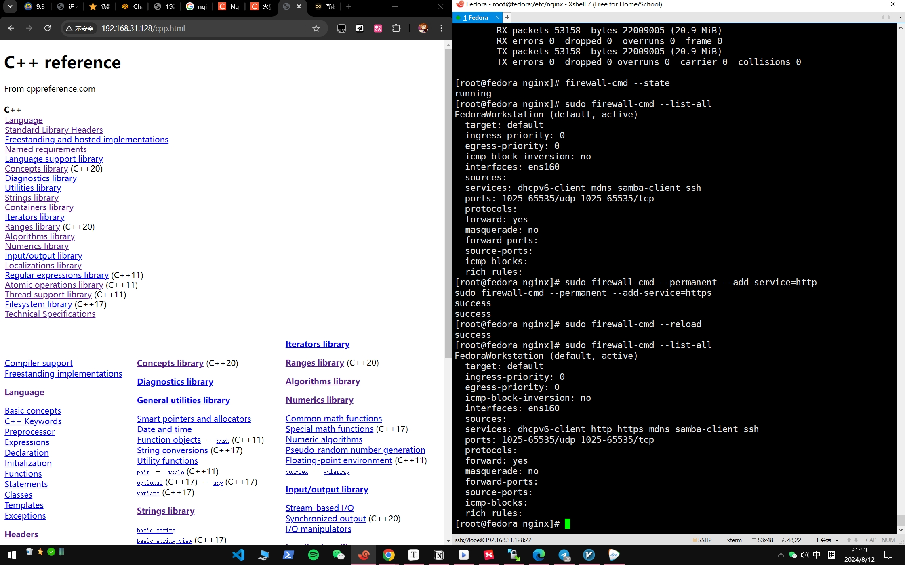
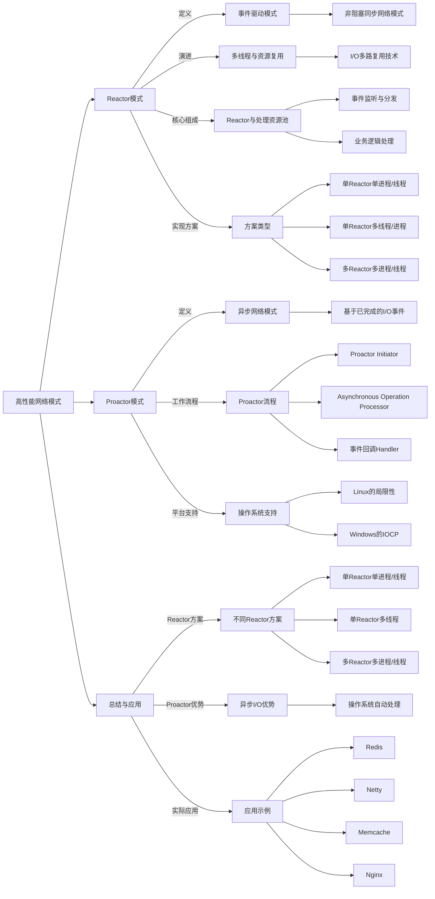
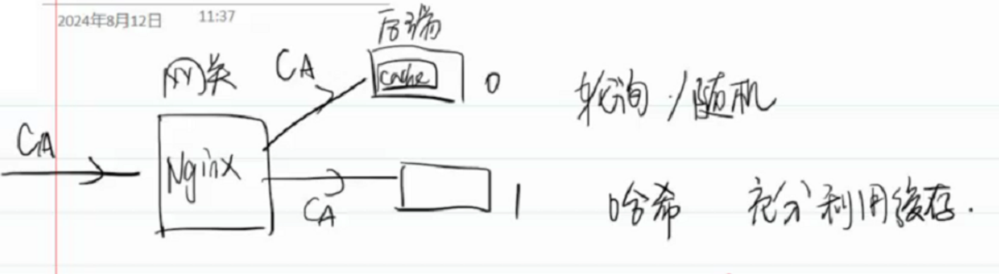
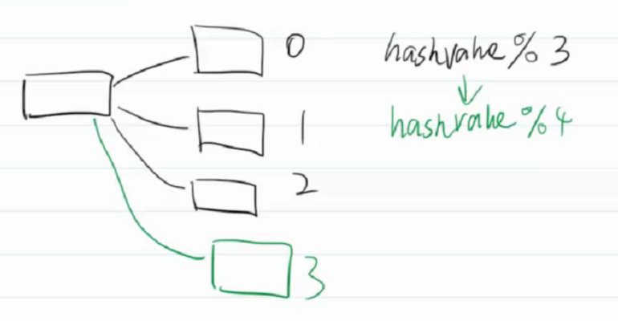
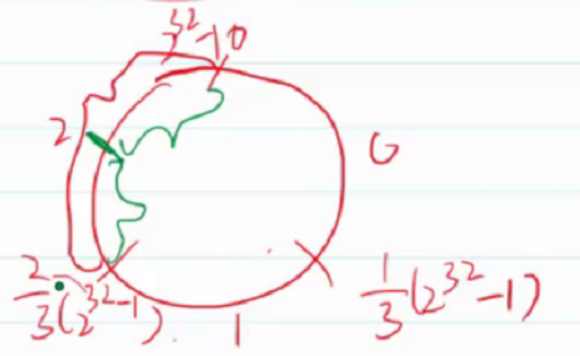

# 01
**Nginx和Apache最大区别是什么？**

> Apache 是基于进程或线程的，会为每一个请求分配一个线程
>
> Nginx是基于异步事件驱动架构的，可同时处理大量链接而不会为每个连接分配单独的进程或线程

> 因此Nginx更加简单，性能更好
>
> 而Apache适合处理连接数量不多但是每个连接处理业务很麻烦的场景

---

**使用Nginx部署一个产品的帮助文档服务器。**



---

**阅读下面的链接**

**[9.3 高性能网络模式：Reactor 和 Proactor | 小林coding (xiaolincoding.com)](https://www.xiaolincoding.com/os/8_network_system/reactor.html#演进)**




---

**有哪些负载均衡策略？各有什么优缺点？**

1. 轮询\随机访问：每次都是从第一个开始轮询访问，效率太低，不能充分利用缓存

   

2. 利用hash策略，可以让每次访问的后端固定（提高了利用率，但是还是会产生雪崩效应）

   

3. 改用环形哈希（一致性哈希），防止了缓存大面积失效

   


**尝试给下面的代码补充一下注释**

```cpp
// WaitGroup 让某个线程处于等待状态
#include <workflow/WFFacilities.h>
// WFTaskFactory.h文件里面包含了所有创建任务相关的函数
#include <workflow/WFTaskFactory.h>
// HttpUtil.h 文件包含了处理HTTP的工具
#include <workflow/HttpUtil.h>
#include <iostream>
#include <string>
#include <signal.h>
using std::cout;
using std::cerr;
using std::string;
static WFFacilities::WaitGroup waitGroup(1);
void sigHandler(int signum){
    cout << "done!\n";
    waitGroup.done();
}
void httpCallback(WFHttpTask *httpTask){
    // 检查报错
    int state = httpTask->get_state(); //获取状态
	int error = httpTask->get_error(); //获取errno
	switch (state){
	case WFT_STATE_SYS_ERROR:
		cerr << "system error: " << strerror(error) << "\n";
		break;
	case WFT_STATE_DNS_ERROR:
		cerr << "DNS error: " << gai_strerror(error) << "\n";
		break;
	case WFT_STATE_SSL_ERROR:
		cerr <<"SSL error: " << error << "\n";
		break;
	case WFT_STATE_TASK_ERROR:
		cerr <<"Task error: " << error << "\n"; 
		break;
	case WFT_STATE_SUCCESS:
		break;
	}
	if (state != WFT_STATE_SUCCESS){
		cerr << "Failed. Press Ctrl-C to exit.\n";
		return;
	}
    // 请求的信息
    protocol::HttpRequest * req = httpTask->get_req();
    cout << "http request method = " << req->get_method() << "\n";
    cout << "http request uri = " << req->get_request_uri() << "\n";
    cout << "http request version = " << req->get_http_version() << "\n";
    // 遍历首部字段
    protocol::HttpHeaderCursor reqCursor(req);
    string key,value;
    while(reqCursor.next(key,value)){
        cout << "key = " << key << " value = " << value << "\n";
    }
    // 响应的信息
    cout << "--------------------------------------------------\n";
    protocol::HttpResponse *resp = httpTask->get_resp();
    cout << "http response version = " << resp->get_http_version() << "\n";
    cout << "http response status code = " << resp->get_status_code() << "\n";
    cout << "http response reason phrase = " << resp->get_reason_phrase() << "\n";
    protocol::HttpHeaderCursor respCursor(resp);
    while(respCursor.next(key,value)){
        cout << "key = " << key << " value = " << value << "\n";
    }

    // workflow框架里面 http报文头和报文体不在一起
    const void *body; //不可修改指向的内容，可以修改指向
    size_t size;
    resp->get_parsed_body(&body,&size);
    cout << static_cast<const char *>(body) << "\n";
}
int main(){
    signal(SIGINT,sigHandler);
    WFHttpTask * httpTask = WFTaskFactory::create_http_task( // 创建任务
        "http://www.baidu.com", // url
        10, // 重定向次数上限
        10, // 重试次数
        //nullptr); //回调函数
        httpCallback); //新的回调函数
    // 在启动任务之前，设置任务的属性
    // 只能改请求，不能改响应
    protocol::HttpRequest * req = httpTask->get_req();
    req->add_header_pair("key1","value1");
    // 启动任务
    httpTask->start();
    waitGroup.wait();
    cout << "finished!\n"; 
    return 0;
}
```

这段代码使用了**Workflow**库（通常用于高并发的网络编程）来创建并执行一个 HTTP 请求。下面是对代码的详细解读，包括其结构、功能、以及如何使用它。

> ### 代码结构与功能
>
> 1. **头文件引入**：
>
>    ```cpp
>    #include <workflow/WFFacilities.h>
>    #include <workflow/WFTaskFactory.h>
>    #include <workflow/HttpUtil.h>
>    #include <iostream>
>    #include <string>
>    #include <signal.h>
>    ```
>
>    - `WFFacilities.h` 提供了等待组（`WaitGroup`）功能，用于控制主线程的等待和同步。
>    - `WFTaskFactory.h` 包含创建任务的相关函数。
>    - `HttpUtil.h` 处理 HTTP 请求和响应。
>    - `iostream` 和 `string` 用于输入输出和字符串操作。
>    - `signal.h` 用于处理信号。
>
> 2. **全局变量**：
>
>    ```cpp
>    static WFFacilities::WaitGroup waitGroup(1);
>    ```
>
>    - 创建一个 `WaitGroup` 实例，初始计数为 1，用于等待 HTTP 请求的完成。
>
> 3. **信号处理函数**：
>
>    ```cpp
>    void sigHandler(int signum){
>        cout << "done!\n";
>        waitGroup.done();
>    }
>    ```
>
>    - 当接收到 `SIGINT` 信号（通常是 Ctrl+C）时，输出 "done!"，并通知 `WaitGroup` 任务已完成。
>
> 4. **HTTP 回调函数**：
>
>    ```cpp
>    void httpCallback(WFHttpTask *httpTask){
>        // 检查报错
>        int state = httpTask->get_state(); // 获取状态
>        int error = httpTask->get_error(); // 获取错误码
>        ...
>    }
>    ```
>
>    - 该函数处理 HTTP 请求的响应，检查状态并输出请求和响应的信息。
>    - 根据不同的状态，输出相应的错误信息。
>
> 5. **主函数**：
>
>    ```cpp
>    int main(){
>        signal(SIGINT,sigHandler); // 注册信号处理函数
>        WFHttpTask * httpTask = WFTaskFactory::create_http_task( 
>            "http://www.baidu.com", // URL
>            10, // 重定向次数上限
>            10, // 重试次数
>            httpCallback); // 回调函数
>        ...
>        waitGroup.wait(); // 等待任务完成
>        cout << "finished!\n"; 
>        return 0;
>    }
>    ```
>
>    - 在主函数中，设置信号处理程序，创建 HTTP 任务，设置请求头，启动任务，并等待任务完成。
>    - 最后输出 "finished!"，表示程序执行结束。
>
> ### 主要功能详解
>
> 1. **任务创建**：
>
>    ```cpp
>    WFHttpTask * httpTask = WFTaskFactory::create_http_task(
>        "http://www.baidu.com", // URL
>        10, // 重定向次数上限
>        10, // 重试次数
>        httpCallback // 回调函数
>    );
>    ```
>
>    - 创建一个 HTTP 任务请求 `"http://www.baidu.com"`，设置重定向和重试次数，并指定回调函数处理响应。
>
> 2. **请求信息设置**：
>
>    ```cpp
>    protocol::HttpRequest * req = httpTask->get_req();
>    req->add_header_pair("key1","value1");
>    ```
>
>    - 获取请求对象，并添加一个自定义 HTTP 请求头。
>
> 3. **任务启动**：
>
>    ```cpp
>    httpTask->start();
>    ```
>
>    - 启动 HTTP 请求任务。
>
> 4. **响应处理**：
>    在 `httpCallback` 函数中，处理 HTTP 响应并输出请求和响应的详细信息，包括：
>
>    - 请求方法、URI、HTTP 版本。
>    - 请求和响应的头部信息。
>    - 响应体内容。
>
> ### 错误处理
>
> 在 `httpCallback` 函数中，使用 `switch` 语句处理请求状态，包括：
>
> - `WFT_STATE_SYS_ERROR`：系统错误
> - `WFT_STATE_DNS_ERROR`：DNS 错误
> - `WFT_STATE_SSL_ERROR`：SSL 错误
> - `WFT_STATE_TASK_ERROR`：任务错误
> - `WFT_STATE_SUCCESS`：请求成功
>
> 每种状态下，根据具体错误输出相应的信息。

---
# 02


# 03


# 04


# 05

